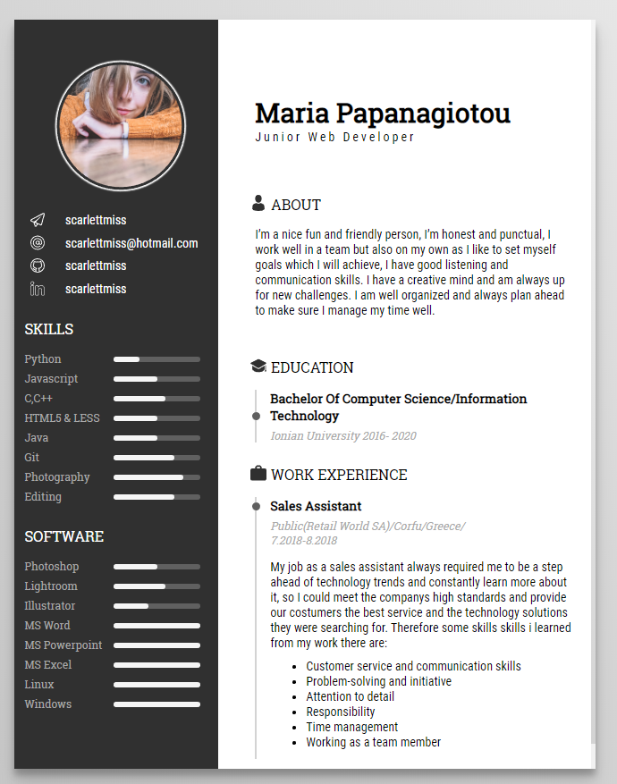

# mnml cv

*This is a minimal static resume template. Powered by Jekyll and GitHub pages.* 
*You can use this to host your own resume on GitHub for **free!***

Checkout the live demo [here](https://scarlettmiss.github.io/cv-template/).

## Installation & setup guide

* [Fork](https://github.com/sharu725/online-cv/fork) the repository
* Go to settings and set Github Pages source as master.
* Your new site should be ready at `https://your_username.github.io/cv-template/`

Change all the details from one place: ``_data/data.yml``

## License

This project is licensed under the [MIT license](LICENSE.txt).
